# 🚀 Terraform Platform Foundation

> A Terraform-based infrastructure foundation built as the **Capstone Project** for the **TerraWeek Challenge 2026**.


---

> ⚠️ **Phase 1**
>
> This repository is the first phase of a larger Platform Engineering learning project.
>
> The goal of this project is **not** to build a production Internal Developer Platform yet, but rather to establish a solid Terraform foundation that follows modern Infrastructure-as-Code best practices. Future iterations will build upon this foundation by introducing Kubernetes, GitOps with ArgoCD, HCP Terraform, and Platform Engineering concepts.

---

# 📖 About

This repository serves as my **TerraWeek Challenge 2026 Capstone Project**.

Instead of provisioning a few isolated AWS resources, I wanted to build something that resembles the structure of a real Terraform codebase—modular, reusable, testable, and easy to extend.

Throughout the six-day challenge I learned how to:

- Build reusable Terraform modules
- Consume official Terraform Registry modules
- Manage multiple environments
- Store remote state securely
- Test Terraform configurations
- Scan Infrastructure as Code for security issues
- Automate validation with GitHub Actions
- Follow Terraform production best practices

This repository brings all of those concepts together into a single Terraform Platform Foundation.

---

# 🎯 Objectives

This project was built with the following goals:

- 🧩 Learn Terraform project structure
- 🌍 Support multiple environments
- ☁️ Consume official Terraform Registry modules
- 📦 Build reusable custom modules
- 🔒 Implement Infrastructure-as-Code security scanning
- 🧪 Validate infrastructure with native Terraform tests
- 🚀 Automate Terraform validation using GitHub Actions
- 📚 Follow HashiCorp recommended best practices

---

# 🏗️ Architecture

> *(Insert Architecture Diagram)*

```
docs/diagrams/architecture.png
```

---

## Components

| Component | Purpose |
|------------|----------|
| Root Module | Composes the infrastructure |
| Labels Module | Standardized naming and tagging |
| Network Module | Deploys networking using the AWS VPC Registry Module |
| Storage Module | Creates shared platform storage |
| GitHub Actions | CI validation |
| Terraform Test | Infrastructure testing |
| Trivy | Security scanning |
| TFLint | Terraform linting |

---

# 📁 Repository Structure

```text
terraform-platform-foundation/
│
├── .github/
│   └── workflows/
│       └── terraform.yml
│
├── docs/
│   ├── diagrams/
│   └── screenshots/
│
├── modules/
│   ├── labels/
│   ├── network/
│   └── storage/
│
├── tests/
│
├── backend.tf
├── providers.tf
├── versions.tf
├── variables.tf
├── outputs.tf
├── locals.tf
├── main.tf
└── README.md
```

---

# 🌍 Environment Strategy

This project explores Terraform Workspaces to isolate infrastructure environments while sharing a single codebase.

Environments explored during the challenge:

- ✅ Development
- ✅ Staging

Terraform Workspaces make it easy to switch between environments while maintaining separate Terraform state.

```bash
terraform workspace new staging
terraform workspace select staging
terraform workspace show
```

## Workspace Trade-offs

### Advantages

- Single codebase
- Separate state files
- Easy environment switching

### Limitations

While workspaces work well for learning projects and smaller infrastructures, larger production environments typically use separate backends and deployment pipelines to provide stronger isolation and access control.

---

# 🧩 Modules

## 🏷️ Labels Module

Responsible for centralized naming conventions and consistent tagging.

Outputs include:

- Standardized resource names
- Common tags
- Environment metadata

---

## 🌐 Network Module

Deploys networking using the official Terraform Registry VPC module.

Resources include:

- Amazon VPC
- Public Subnets
- Private Subnets
- Internet Gateway
- NAT Gateway
- Route Tables

---

## 🪣 Storage Module

Creates a reusable Amazon S3 bucket for platform storage.

Outputs include:

- Bucket Name
- Bucket ARN

---

# ☁️ AWS Resources

The current implementation provisions:

- Amazon VPC
- Public Subnets
- Private Subnets
- Internet Gateway
- NAT Gateway
- Elastic IP
- Route Tables
- Amazon S3 Bucket

---

# 🧪 Infrastructure Testing

Terraform's native testing framework is used to validate infrastructure behaviour before deployment.

The project includes:

- ✅ terraform fmt
- ✅ terraform validate
- ✅ terraform test

### Plan vs Apply Tests

Terraform supports two types of infrastructure tests.

#### Plan Tests

- Do not create infrastructure
- Validate configuration and expected values
- Fast and ideal for CI pipelines

#### Apply Tests

- Provision temporary infrastructure
- Validate real cloud resources
- Destroy resources after execution

This project primarily uses **plan-based tests**, making them fast, repeatable, and suitable for automated validation.

---

# 🔒 Security & Quality

Infrastructure quality is validated using multiple tools.

## Security

- ✅ Trivy
- ✅ Infrastructure security scanning

## Linting

- ✅ TFLint

## Formatting

- ✅ terraform fmt

## Validation

- ✅ terraform validate

## Testing

- ✅ terraform test

---

# 🚀 GitHub Actions

```text
Developer
    │
git push
    │
    ▼
GitHub Repository
    │
    ▼
GitHub Actions
    │
    ├── terraform fmt
    ├── terraform validate
    ├── terraform test
    ├── tflint
    ├── trivy
    └── terraform plan
    │
    ▼
Merge
    │
    ▼
Terraform Apply
    │
    ▼
AWS
```

Every Pull Request automatically performs:

1. **terraform fmt** — Checks formatting
2. **terraform init** — Initializes Terraform
3. **terraform validate** — Validates configuration
4. **terraform plan** — Generates execution plan

This provides automated validation before infrastructure changes are merged.

AWS authentication is securely handled using GitHub Secrets.

---

# 🍫 Bonus Explorations

Beyond the Day 6 requirements, I also explored:

## ✅ HCP Terraform

I experimented with HashiCorp's managed Terraform platform to better understand remote execution and future platform workflows.

---

## ✅ Pre-commit Hooks

To improve the local development experience, I configured pre-commit hooks that automatically run:

- terraform fmt
- terraform validate
- TFLint
- Trivy

before every commit.

This helps catch issues early, before they ever reach CI.

---

# 🚫 Provisioners

This project intentionally avoids Terraform provisioners (`remote-exec` and `local-exec`).

Instead, it follows HashiCorp's recommended practices by keeping infrastructure declarative.

Future versions of this project will use approaches such as:

- cloud-init (`user_data`)
- container images
- Kubernetes workloads
- GitOps

instead of imperative provisioning.

---

# ✅ Best Practices Implemented

This project incorporates Terraform best practices covered throughout TerraWeek.

| Practice | Status |
|-----------|--------|
| Remote S3 Backend | ✅ |
| Native S3 State Locking | ✅ |
| Terraform Version Pinning | ✅ |
| Provider Version Pinning | ✅ |
| Official Registry Module | ✅ |
| Custom Modules | ✅ |
| Variables | ✅ |
| Outputs | ✅ |
| Standard Naming & Tagging | ✅ |
| terraform fmt | ✅ |
| terraform validate | ✅ |
| terraform test | ✅ |
| Trivy Security Scan | ✅ |
| TFLint | ✅ |
| GitHub Actions CI | ✅ |
| Pre-commit Hooks | ✅ |
| terraform destroy | ✅ |

---

# 📸 Demo

## 🏗️ Architecture


## High-level Architecture of the project


                          GitHub
                             │
                             ▼
                     GitHub Actions
        fmt → validate → test → tflint → plan
                             │
                             ▼
                    Terraform Root Module
          ┌──────────────┬──────────────┐
          │              │              │
          ▼              ▼              ▼
      Labels         Network        Storage
                         │
                         ▼
      terraform-aws-modules/vpc/aws
                         │
         ┌───────────────┴───────────────┐
         │                               │
         ▼                               ▼
     Amazon VPC                     Amazon S3
         │
         ├──────────────┐
         ▼              ▼
  Public Subnets   Private Subnets
         │
         ▼
    NAT Gateway

---

## 🌍 Terraform Workspaces

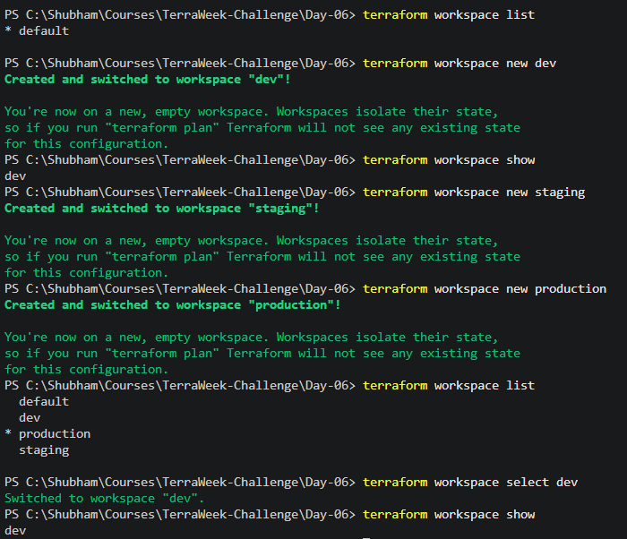
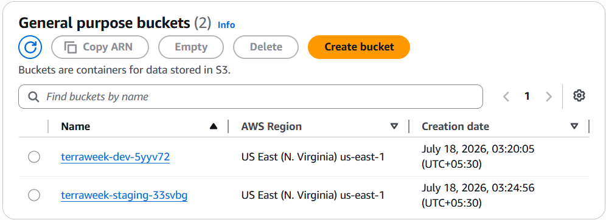


---

## 🧪 Terraform Tests

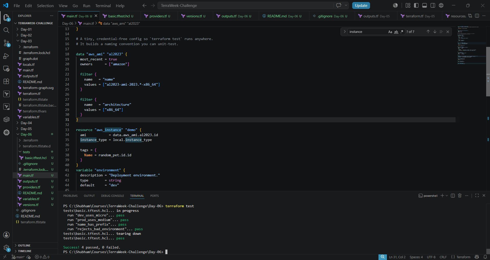

---

## 🔒 Trivy Security Scan

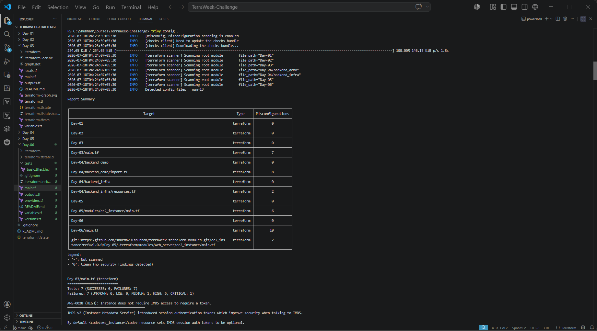

---

## 🔧 Pre-commit Hooks

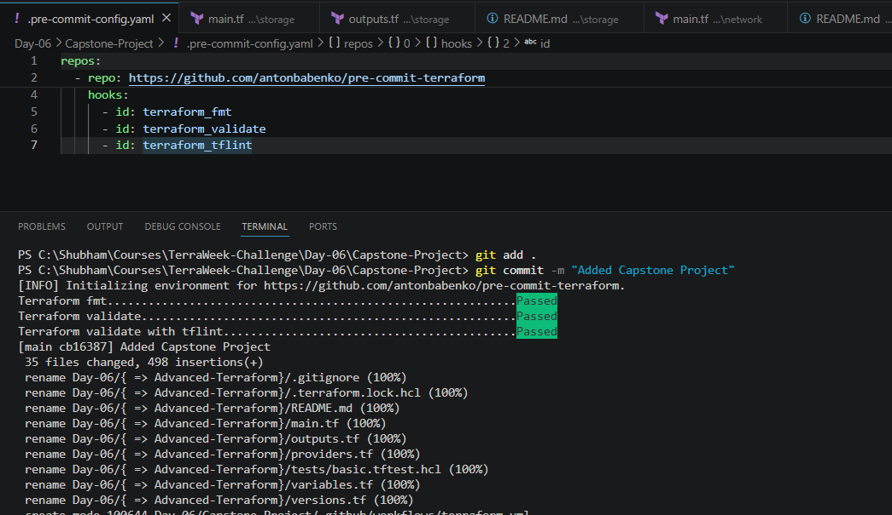


---

## ☁️ HCP Terraform

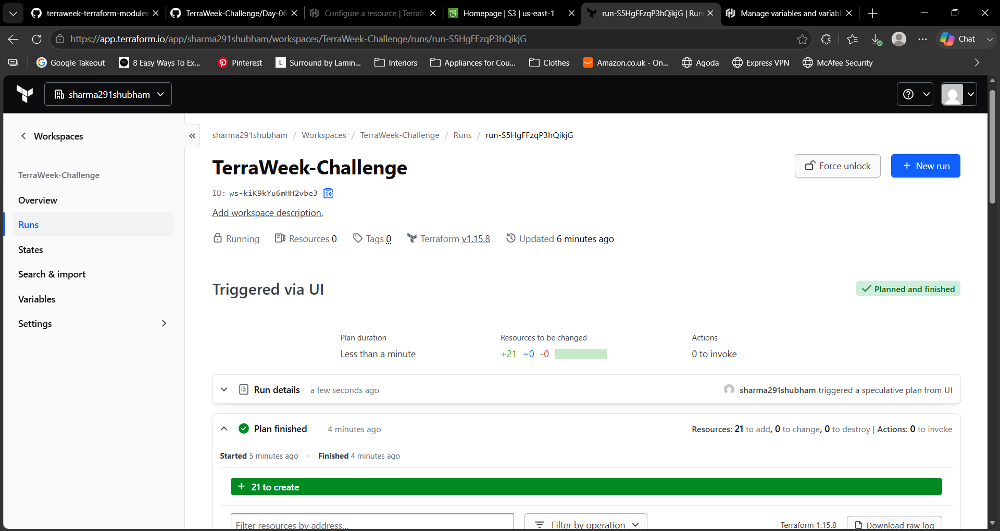

---

## 🚀 GitHub Actions

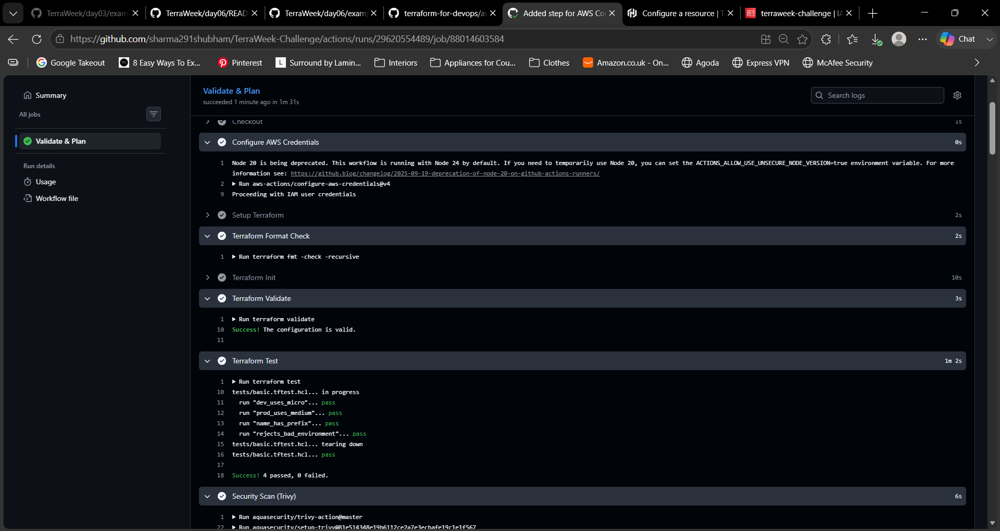

---

## ☁️ AWS Console

- VPC
- Public Subnets
- Private Subnets
- NAT Gateway
- S3 Bucket

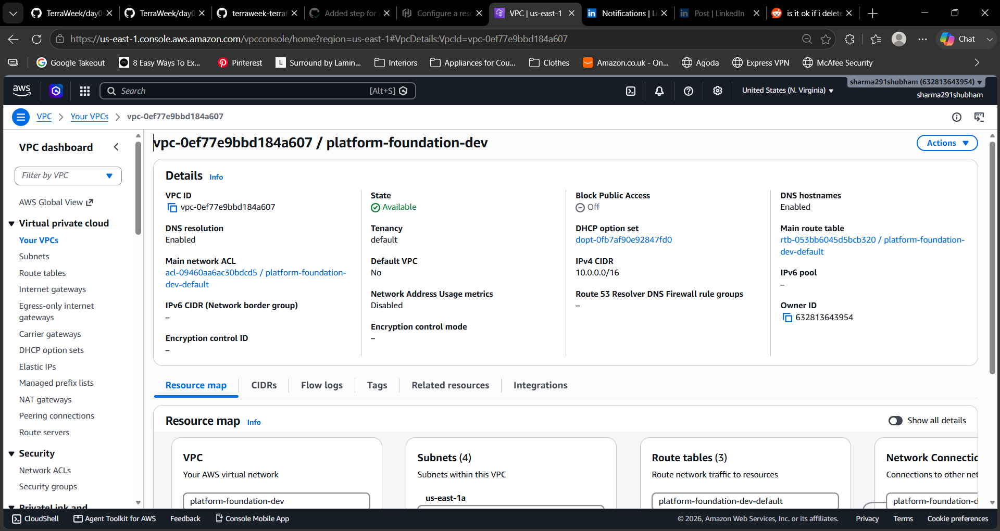
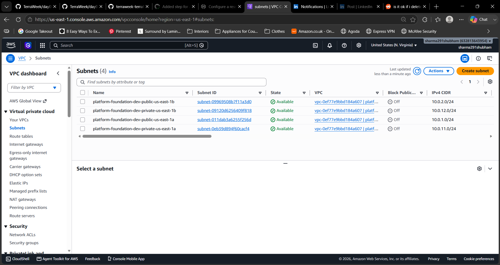
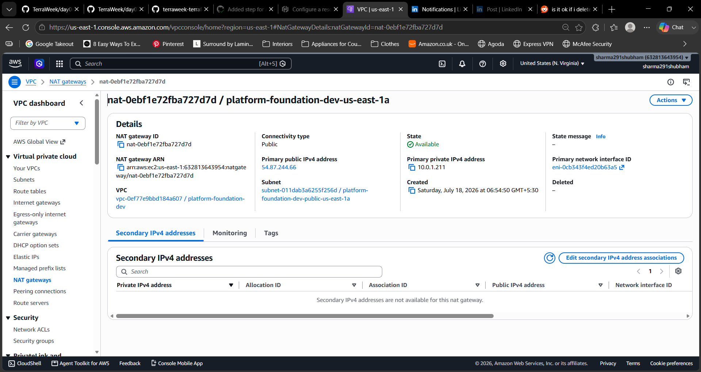
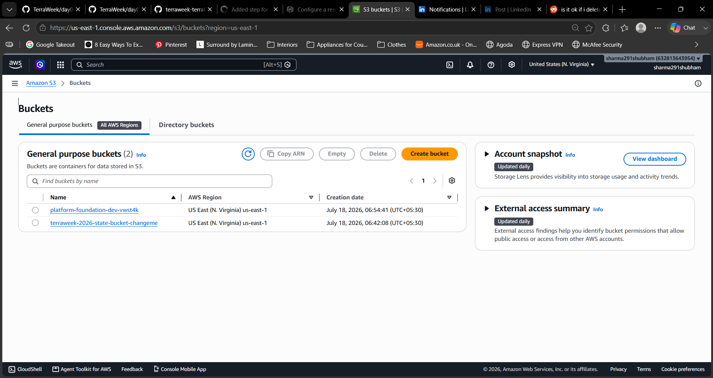

---

# 🗺️ Roadmap

This repository represents **Phase 1**.

Future iterations will expand into a larger Platform Engineering project featuring:

- ☸️ Amazon EKS
- 🚀 GitOps with ArgoCD
- 🔄 Continuous Delivery
- 📦 Kubernetes Workloads
- 🔐 IAM Improvements
- 📈 Monitoring & Observability
- ☁️ HCP Terraform Workspaces
- 🏗️ Internal Developer Platform concepts

---

# 🙏 Acknowledgements

This project was built as the **Capstone Project** for the **Train With Shubham TerraWeek Challenge 2026**.

A heartfelt thank you to Shubham Londhe for creating the TerraWeek Challenge 2026 and encouraging engineers to learn Terraform by building real projects, adopting Infrastructure as Code best practices, and sharing their learning publicly. The challenge provided an excellent foundation for developing practical Terraform skills through hands-on implementation.

The challenge encouraged not just learning Terraform commands, but also understanding how production Terraform projects are structured and maintained.

---

# 👨‍💻 Author

**Shubham Sharma**

Platform Engineering • DevOps • Internal Developer Platforms

- 💼 LinkedIn: https://linkedin.com/in/sharma291shubham
- 🐙 GitHub: https://github.com/sharma291shubham

---

> *Built as part of the TerraWeek Challenge 2026 — learning Terraform by building real infrastructure.*
